# PDF 작업실

브라우저 안에서만 PDF를 다루는 웹앱입니다. 합치기, 나누기, 쪽 순서 바꾸기, 사진 변환, 꾸미기(쪽번호 · 워터마크 · 서명과 도장), 용량 줄이기, 암호를 설치 없이 쓸 수 있습니다.

## 파일은 브라우저 밖으로 나가지 않아요

- 모든 처리는 사용자의 브라우저 안(JavaScript)에서 끝납니다. 서버는 화면을 이루는 정적 파일(HTML·CSS·JS)만 보내 주고, 파일을 받는 주소가 아예 없습니다.
- 서버가 `Content-Security-Policy`의 `connect-src 'self'`를 보내므로, 페이지가 다른 사이트로 데이터를 보낼 수 없습니다.
- 라이브러리도 CDN을 쓰지 않고 이 서버에서 직접 제공합니다(`/vendor/*`).
- 결과물은 `Blob`으로 만들어 브라우저 내려받기로 저장합니다.

## 화면

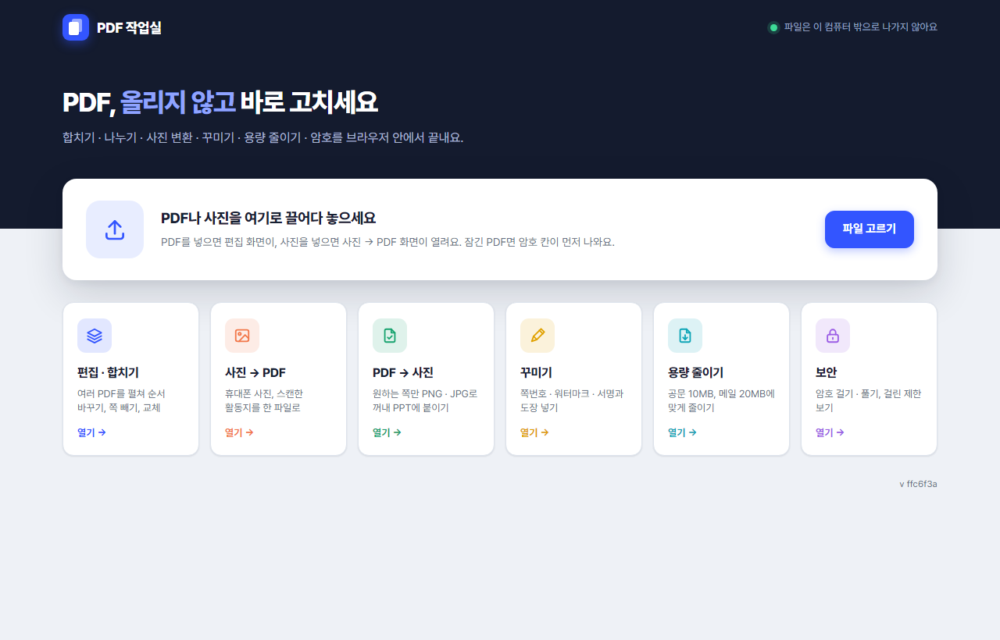

**처음 화면** — 남색 띠 아래 "파일 넣기" 카드와 도구 카드 6개(편집 · 합치기 / 사진 → PDF / PDF → 사진 / 꾸미기 / 용량 줄이기 / 보안)가 있습니다. 주소 끝의 `#compress`처럼 도구 이름을 붙이면 그 도구가 바로 열리고, 예전 이름 `#lock` · `#number`는 보안 · 꾸미기로 이어집니다.

- PDF나 사진을 끌어다 놓거나 [파일 고르기]를 누르면 알맞은 도구가 열립니다.
  - PDF가 하나라도 있으면 **편집** 화면으로 갑니다.
  - 사진만 넣으면 **사진 → PDF** 화면으로 갑니다.
  - 둘이 섞여 있으면 PDF는 편집으로, 사진은 사진 → PDF 목록에 넣어 두고 알림으로 알려 줍니다.
- 도구 카드를 누르면 그 도구가 바로 열립니다.

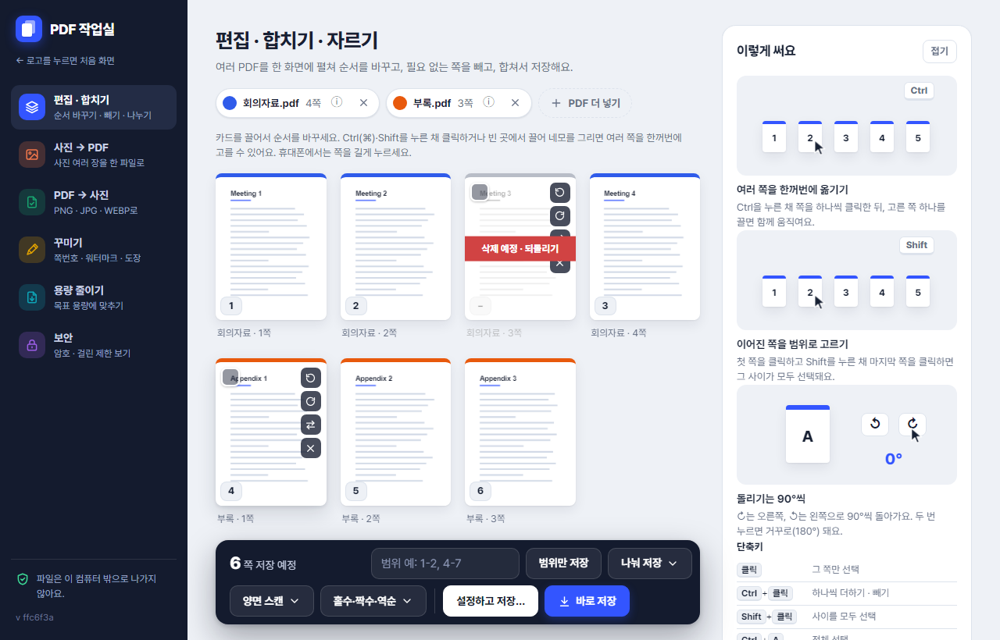

**작업 화면** — 왼쪽 남색 사이드바에서 도구를 바꿉니다.

- 도구를 옮겨 다녀도 각 도구에 넣은 파일과 상태는 그대로 남습니다.
- 사이드바는 키보드 화살표로도 이동할 수 있습니다.
- 폭 820px 이하에서는 사이드바가 화면 위쪽의 가로 줄로 바뀝니다.
- 왼쪽 위 로고를 누르면 새로고침 없이 모든 상태를 지우고 처음 화면으로 돌아갑니다.

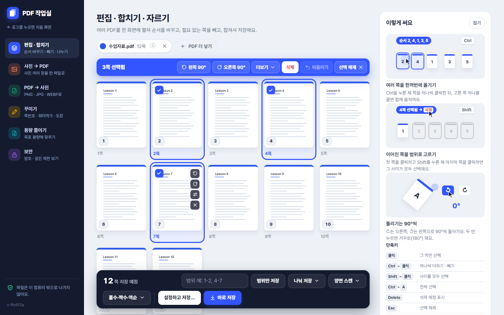

**여러 쪽 선택** — 탐색기처럼 여러 쪽을 골라 한꺼번에 옮기고, 돌리고, 지웁니다.

- 1쪽 이상 고르면 작업 영역 위에 파란 **선택 막대**가 붙습니다(스크롤해도 보임): 왼쪽 90° · 오른쪽 90° · 맨 앞으로 · 맨 뒤로 · 몇 쪽 뒤로… · 선택한 쪽만 저장 · 삭제/복구 · 되돌리기 · 선택 해제. 좁으면 덜 쓰는 버튼은 "더보기"로 접힙니다.
- 고른 카드를 끌면 고른 쪽이 모두 원래 순서대로 함께 옮겨집니다. 커서 옆에 겹친 카드와 "N쪽" 배지가 보이고, 화면 위·아래 끝에 가까우면 자동으로 스크롤합니다.
- 옮기기 · 회전 · 삭제 · 교체는 50단계까지 되돌릴 수 있습니다.
- 폭 1280px 이상에서는 오른쪽에 **"이렇게 써요"** 패널(움직이는 예시 3개 + 단축키)이 있고, 접으면 얇은 막대만 남습니다(접힘 상태 기억). 그보다 좁으면 제목 옆 [사용법] 버튼으로 오른쪽 서랍을 엽니다.

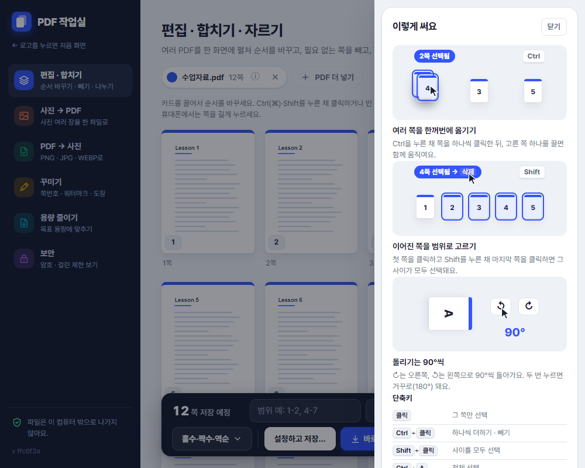

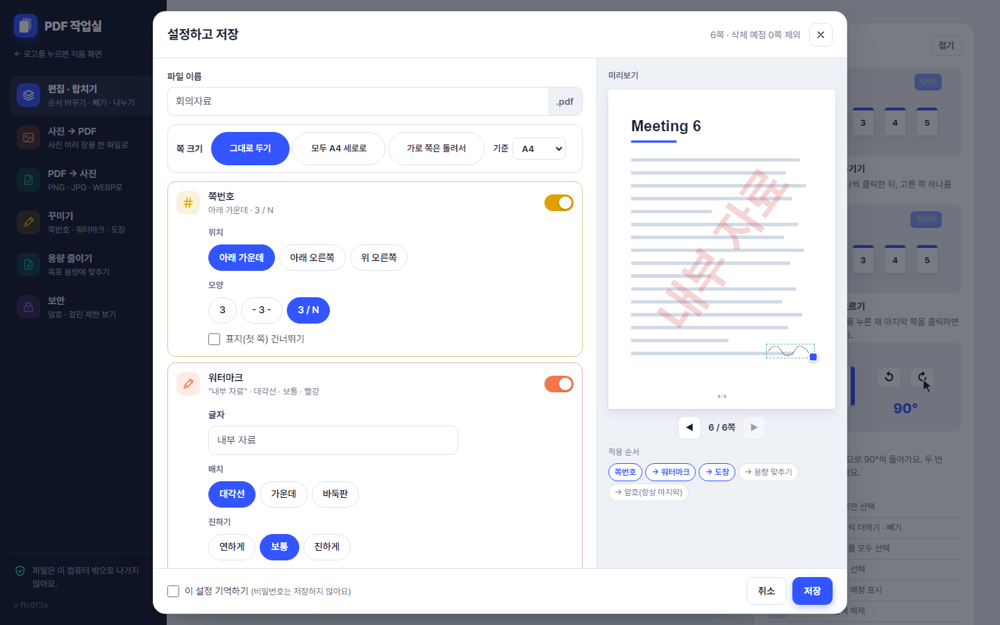

**설정하고 저장…** — 쪽번호 · 워터마크 · 서명/도장 · 암호 · 용량 목표를 켜고 끄며 오른쪽 미리보기로 확인합니다.

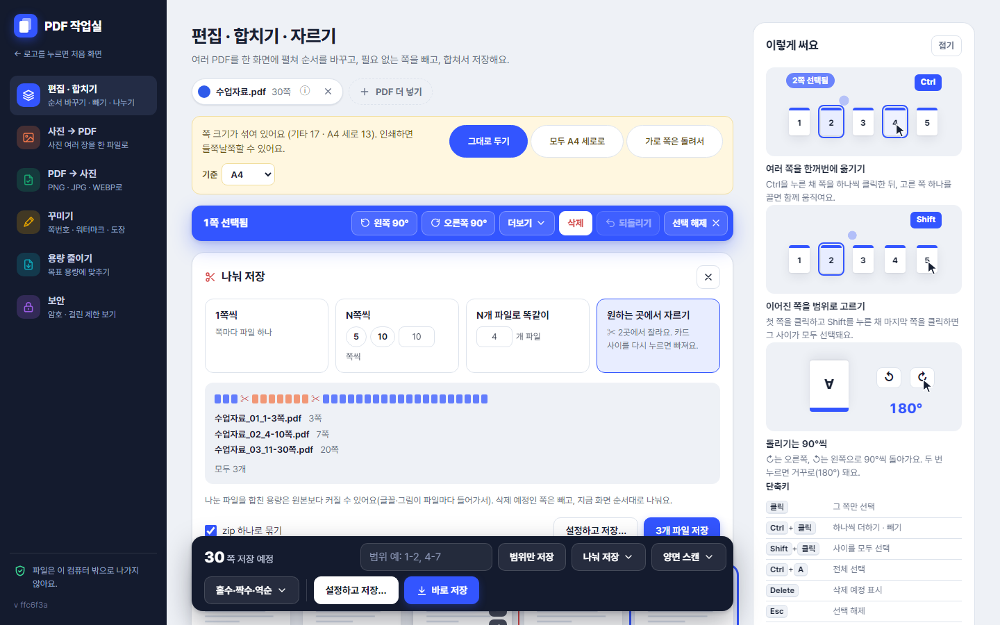

**나눠 저장 ▾** — 1쪽씩 / N쪽씩 / N개 파일로 / 원하는 곳에서 자르기(카드 사이 ✂). 만들어질 파일 목록을 미리 보여 줍니다.

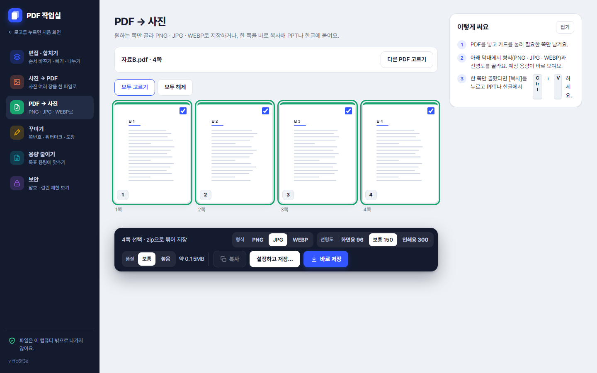

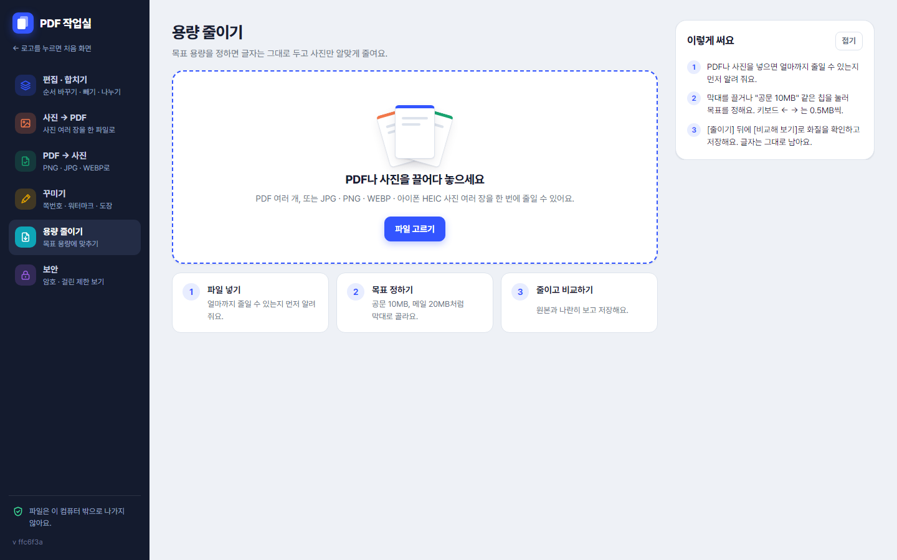

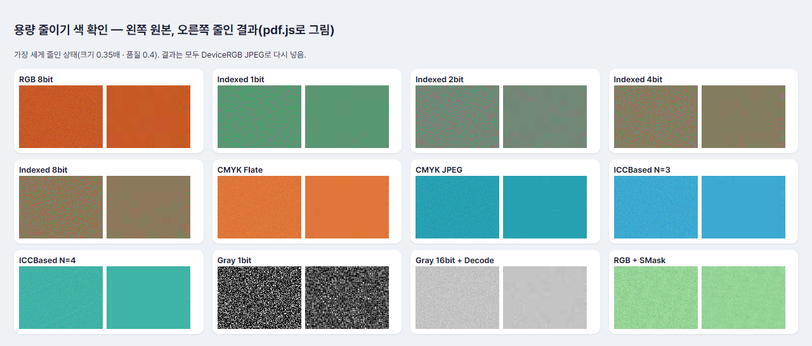

**색 확인** — 한글(HWP)에서 흔한 이미지 형식(Indexed · CMYK · ICCBased · 16bit · SMask …)을 가장 세게 줄였을 때 원본(왼쪽)과 결과(오른쪽).

**용량 줄이기** — 목표를 막대로 정하면 글자는 그대로 두고 사진만 줄입니다.

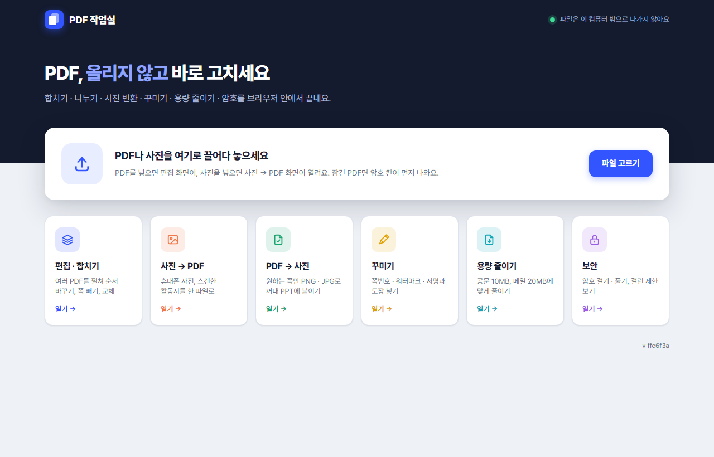

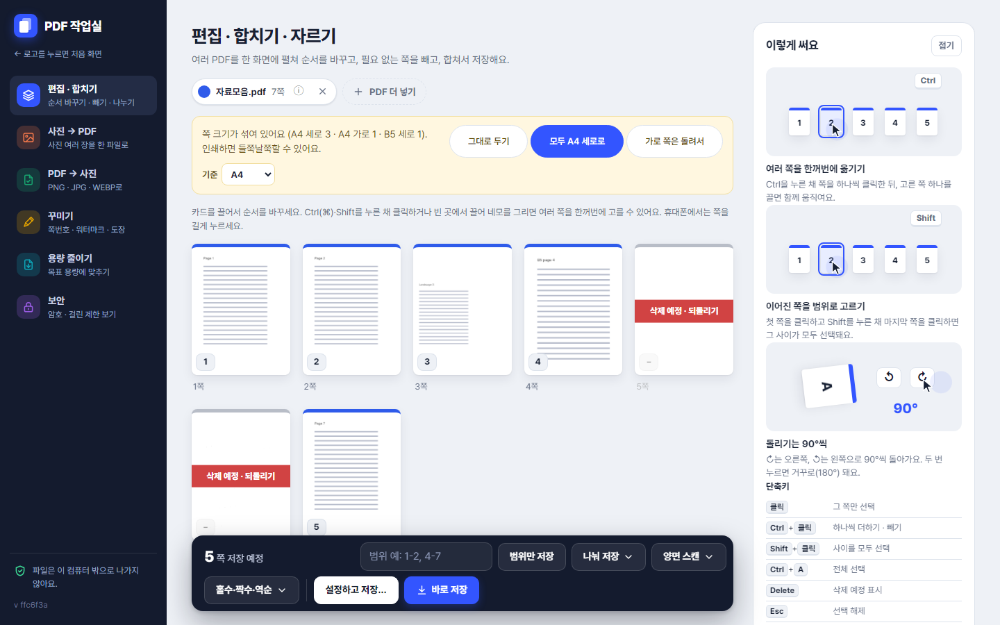

**쪽 크기 맞추기** — 크기가 섞여 있으면 안내줄에서 [모두 A4 세로로] · [가로 쪽은 돌려서]를 고를 수 있어요.

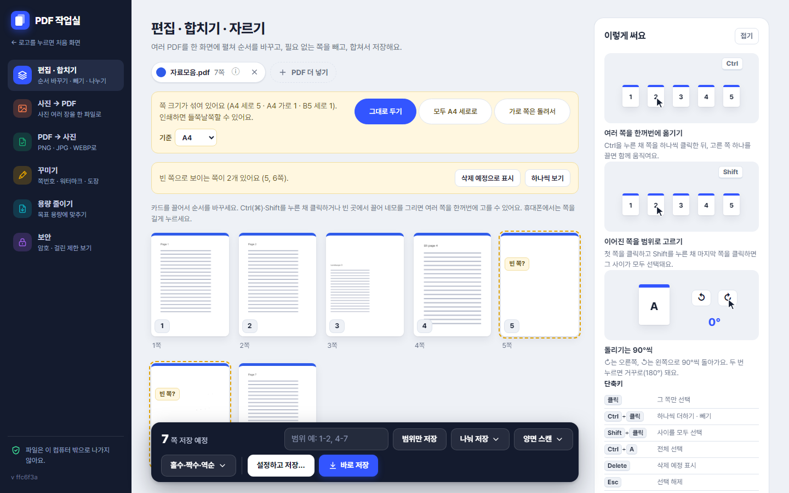

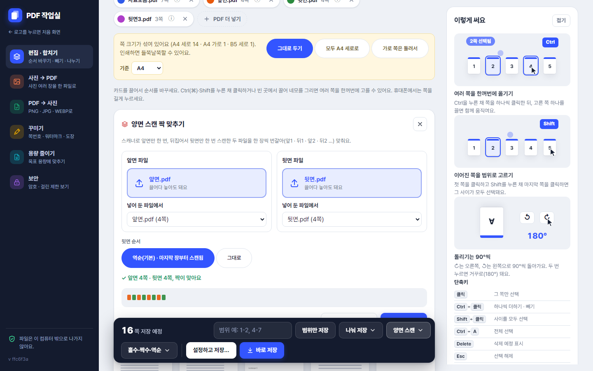

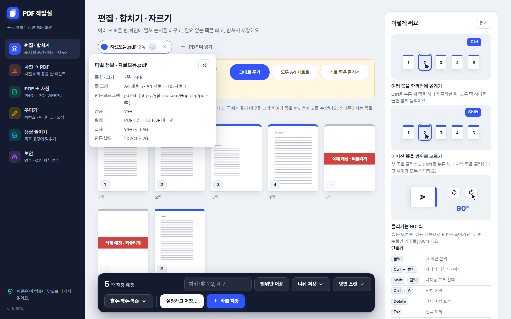

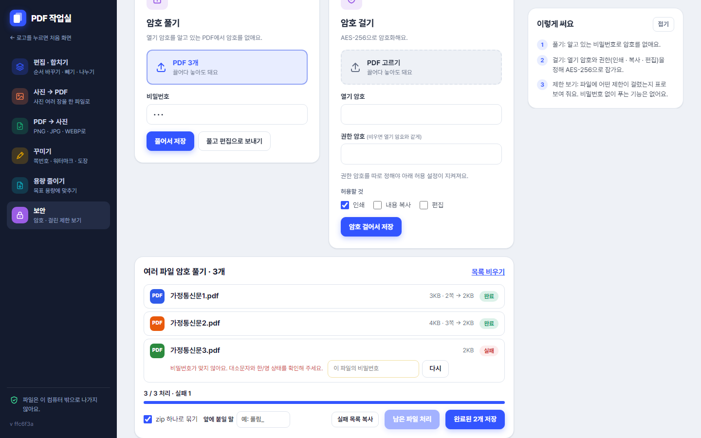

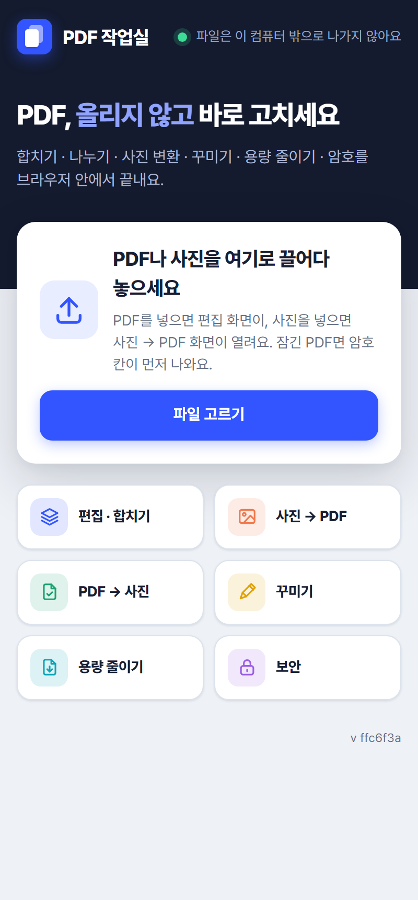

## 기능

| 도구 | 할 수 있는 일 |
|---|---|
| 편집 · 합치기 | PDF 여러 개를 한 화면에 펼쳐 놓고 끌어서 순서 바꾸기(마우스·터치). **여러 쪽 선택**(Ctrl/Shift+클릭, 체크 상자, 빈 곳에서 네모 끌기, 휴대폰은 길게 누르기) 후 한꺼번에 끌어 옮기기 · 맨 앞/맨 뒤/N쪽 다음으로 · 90° 회전 · 삭제 예정 · 선택한 쪽만 저장. 되돌리기/다시 하기 50단계. 쪽마다 ↺ ↻ 회전 · 다른 쪽으로 교체 · 삭제 예정 표시. 저장 막대: 범위만 저장(`1-2, 4-7`), **나눠 저장 ▾**(1쪽씩 / N쪽씩 / N개 파일로 똑같이 / 카드 사이 ✂로 원하는 곳에서 자르기, 미리보기와 `원본이름_01_1-10쪽.pdf` 이름, zip 묶기), 홀수 · 짝수 · 역순, **[설정하고 저장…]**과 **[바로 저장]**. 잠긴 PDF는 노란 안내줄에서 비밀번호를 넣으면 함께 편집. **쪽 크기 맞추기**: 쪽 크기(회전 반영)를 A4 세로/가로 · Letter · B5 · 기타로 나눠 섞여 있으면 노란 안내줄 → [그대로 두기 / 모두 A4 세로로 / 가로 쪽은 돌려서](기준 A4 · Letter, 원본 쪽을 비율 유지로 가운데 배치, 글자 선택 유지). **양면 스캔 ▾**: 앞면 · 뒷면 파일을 한 장씩 번갈아(뒷면 역순 기본), 쪽수가 다르면 경고 후 남는 쪽은 끝에, [편집 화면에 펼치기] · [짝 맞춰서 저장](`앞면이름_양면.pdf`). **빈 쪽 찾기**: 썸네일과 같은 렌더로 "거의 흰 쪽"(가장자리 4% 빼고 밝기 235 이상이 99.3% 이상, 글자 레이어 없음)을 찾아 안내줄 · "빈 쪽?" 배지, [삭제 예정으로 표시] · [하나씩 보기](자동 삭제는 안 함). 파일 칩의 **ⓘ 파일 정보** |
| 사진 → PDF | JPG · PNG · WEBP · **아이폰 HEIC/HEIF** · GIF · BMP 여러 장을 순서대로 PDF로. 용지(A4 세로/가로/원본 크기), 여백(없음/좁게/보통), 비율 유지 가운데 맞춤, 휴대폰 사진 EXIF 방향 반영. HEIC은 처음 들어올 때만 변환기(약 3MB)를 불러와 JPEG로 바꾸고, 실패하면 "아이폰 설정 → 카메라 → 포맷 → 높은 호환성" 안내. TIFF는 파일마다 "아직 지원하지 않아요" 알림 |
| PDF → 사진 | 고른 쪽만 저장. 형식 PNG · JPG · WEBP, 선명도 화면용 96 / 보통 150 / 인쇄용 300(휴대폰은 150까지, 한 변 8192px · 1,670만 화소를 넘으면 자동으로 낮춤), JPG · WEBP 품질 보통 0.8 / 높음 0.92, 첫 쪽을 실제로 바꿔 본 **예상 용량**. 한 쪽만 골랐으면 **[복사]**로 PNG를 클립보드에(PPT · 한글에 Ctrl+V). 이름은 `원본이름_p1.png`(쪽수 자릿수만큼 0을 채움, 120쪽이면 `p001`), 여러 장은 zip. 진행률과 [취소] |
| 꾸미기 | 파일을 2개 이상 넣으면 **여러 파일 일괄**(같은 설정, 쪽번호는 파일마다 1부터, 도장은 같은 비율 자리). PDF 하나에 **쪽번호**(아래 가운데/아래 오른쪽/위 오른쪽, `3` / `- 3 -` / `3 / N`, 표지 건너뛰기) · **워터마크**(한글 가능, 대각선/가운데/바둑판, 진하기 3단계, 빨강/회색/파랑, 쪽을 이미지로 굳히기) · **서명 · 도장 이미지**(손으로 그리기 · 이미지 올리기, 흰 배경 지우기, 마지막 쪽/모든 쪽/고른 쪽)를 미리보기로 보며 넣기. 도장은 미리보기에서 끌어 옮기고 모서리로 크기 조절(쪽 크기 대비 비율로 저장, 회전된 쪽도 보이는 방향 기준). 서명 · 도장은 이 브라우저(IndexedDB)에만 보관 |
| 용량 줄이기 | PDF 여러 개 또는 사진(HEIC 포함) 여러 장. 여러 파일은 **일괄 처리**(상태 배지 대기/처리 중/완료/실패, "5 / 8 처리 · 실패 1", [취소]는 지금 파일까지 끝내고 멈춤, 실패 줄 [따로 처리], 목표는 "파일마다" 또는 "전체 합쳐서"(크기에 비례해 나눔), zip · 앞에 붙일 말, [실패 목록 복사]). 넣자마자 "얼마까지 줄일 수 있는지" 계산. 볼륨 막대 모양 목표 슬라이더(왼쪽 끝 = 예상 최소, 오른쪽 끝 = 원래 용량, 원래보다 작은 "공문 10MB" · "메일 20MB" · "5MB" · "2MB" 칩, 숫자 입력과 연동, 예상 화질 선명/보통/흐림). 한 칸은 줄일 수 있는 폭의 약 1/100을 0.01 · 0.02 · 0.05 · 0.1 · 0.2 · 0.5 · 1MB 중 하나로 올려 정하고 표시 자릿수도 맞춰요(0.5MB 파일이면 0.01MB, `0.47MB`). 기본 목표는 10MB 넘는 파일이면 10MB, 아니면 원래의 70%. 원래 이상이면 "원본 그대로면 돼요", 최소보다 작으면 3단계 안내, 줄일 폭이 원래의 5% 미만이면 막대를 잠그고 "더 줄일 여지가 거의 없어요"(숫자를 적으면 3단계는 쓸 수 있음). 사진 여러 장은 "한 장당 / 전체 합쳐서". 진행 막대와 [취소], 결과 "30.2MB → 9.6MB ✓ 목표(10MB) 이하"와 "목표 10MB · 결과 9.4MB · 화질 선명", 건너뛴 사진 N장(이유별), 원본과 나란히 [비교해 보기](확대 100~300%) |
| 보안 | 파일을 2개 이상 넣으면 **여러 파일 일괄**(같은 비밀번호로 한 번에, 비밀번호가 다른 파일은 그 줄에서 따로 입력해 재시도). 암호 풀기(풀어서 저장, 풀고 편집으로 보내기) · 암호 걸기(AES-256, 열기 암호 · 권한 암호, 인쇄 · 복사 · 편집 허용 선택) · **이 파일에 걸린 제한 보기**(열기 암호, 인쇄 · 복사 · 편집 · 주석 · 양식 · 쪽 조립 허용 여부 표). 비밀번호 없이 제한을 푸는 기능은 없음 |

### 저장 두 가지

- **[바로 저장]** (<kbd>Ctrl</kbd>+<kbd>S</kbd>): 묻지 않고 바로 저장해요. "이 설정 기억하기"로 저장해 둔 설정이 있어도 쓰지 않아요(늘 예측 가능하게). 브라우저의 "페이지 저장"은 막아요.
- **[설정하고 저장…]** (<kbd>Ctrl</kbd>+<kbd>Shift</kbd>+<kbd>S</kbd>): 파일 이름(쓸 수 없는 `\ / : * ? " < > |`는 `_`로)과 다섯 항목을 켜고 끄는 창이 열려요.
  1. 쪽번호 2. 워터마크 3. 서명 · 도장 이미지 4. 암호 걸기(열기 암호 두 번, 인쇄 · 복사 · 편집 허용) 5. 용량 목표(`__ MB 이하로 맞추기`)
  - 오른쪽 미리보기에 실제 쪽 위로 쪽번호 · 워터마크 · 도장이 겹쳐 보이고 ◀ ▶로 쪽을 넘겨요.
  - 적용 순서: 쪽번호 → 워터마크 → 도장 → 용량 맞추기 → 암호(항상 마지막).
  - "이 설정 기억하기"는 localStorage에 저장하고, 비밀번호는 절대 저장하지 않아요. 휴대폰에서는 전체 화면 시트가 돼요.
- 편집 · 나눠 저장 · PDF → 사진 · 꾸미기 · 용량 줄이기 모두 같은 두 버튼을 써요. 나눠 저장에서 설정을 고르면 모든 파일에 적용하고 쪽번호는 파일마다 1부터예요.

### 용량 줄이기는 이렇게 해요 (`public/compress.js`)

1. **손실 없이**: 다시 저장(object stream 사용). PDF/A-1 문서는 object stream을 쓸 수 없어 없이 저장해요. 원본 그대로 목표 이하면 여기서 끝.
2. **사진만 줄이기 — 목표 안에서 최대한 선명하게**: 글자 · 글꼴은 그대로 두고 사진만 다시 만들어요.
   - **큰 사진부터** 줄이고, 목표에 닿으면 나머지 사진은 **원본 그대로** 둬요. 가장 선명한 설정(t=1)으로 몇 장만 줄여서 되면 거기서 멈추고, 모든 사진을 줄여야 하면 크기(0.35~1배)와 JPEG 품질(0.4~0.9)을 한 값 t로 묶어 **이진 탐색**(최대 7번)한 뒤 남는 만큼 작은 사진을 원본으로 되돌려요.
   - 실제로 저장한 크기로 몇 번 더 맞춰서 결과가 **목표의 85~100%**에 오게 해요(넘으면 한 장 더 줄이고, 너무 작으면 원본을 되돌림).
   - 줄여도 커지는 사진(이미 작은 것)은 원본 유지. 사진 하나를 읽지 못해도 그 사진만 원본으로 두고 "건너뛴 사진 N장(이유별)"로 알려요.
   - 읽는 형식(한글 · HWP에서 만든 PDF에 흔한 것): JPEG 회색 · RGB(브라우저 디코더), CMYK JPEG(Adobe 반전 · Decode 배열, JS 디코더), Flate 회색 · RGB · CMYK · **Indexed(팔레트) 1 · 2 · 4 · 8bit**, 1 · 2 · 4 · 16bit, **ICCBased(N=1/3/4)**, **Decode 배열**, PNG 예측, **SMask**(같은 크기로 함께 줄임). CMYK는 pdf.js와 같은 변환식으로 RGB로 바꿔요.
   - 건드리지 않는 것: JBIG2 · CCITT · 1bit 마스크("이미 작은 흑백 이미지"), JPEG 2000, Separation · DeviceN · Lab 색 공간, 색 키 마스크, 4천만 화소 넘는 사진.
3. **쪽 전체를 사진으로**(마지막 수단): 자동으로 하지 않고 "쪽을 사진으로 바꾸면 X MB까지 줄일 수 있어요. 대신 글자를 선택하거나 검색할 수 없어요." 창으로 물어본 뒤, pdf.js로 쪽을 그려 dpi · 품질을 같은 방식으로 맞춰요. 줄일 사진이 없는 글자 위주 파일도 이 창을 거쳐 쓸 수 있어요.

- 무거운 계산은 Web Worker(`compress-worker.js`, OffscreenCanvas가 있을 때)에서 돌려요. Worker가 죽거나(onerror) 30초 동안 말이 없거나 메모리가 모자라면 메인 스레드에서 사진 하나마다 쉬어 가며 다시 해요. 사진은 한 장씩 풀고 줄인 뒤 ImageBitmap을 닫고 canvas 크기를 0으로 되돌려 바로 메모리를 돌려줘요. (`?worker=0`을 주소에 붙이면 메인 스레드만 써요 — 측정용)
- 사진 파일은 canvas로 다시 인코딩해요. PNG는 투명한 곳이 있으면 WEBP(또는 PNG 유지), 없으면 JPG로 바꾸고 카드에 알려요. 휴대폰 사진 방향(EXIF)은 반영해요.
- 글자 위주 PDF는 "이 파일은 약 N MB까지만 줄일 수 있어요(대부분 글꼴이라서)"라고 미리 알려요.

### 여러 파일 일괄 처리 (보안 · 꾸미기 · 용량 줄이기)

- 파일을 2개 이상 넣으면 목록 모드: 줄마다 파일색 아이콘 · 이름 · 크기와 쪽수 · 상태 배지(대기 / 처리 중 / 완료 / 실패), 실패면 이유와 [따로 처리].
- 설정은 위에 한 번만. 한 파일씩 차례로 처리해 메모리를 아끼고, 하나가 실패해도 나머지는 계속해요. [취소]는 지금 파일까지 끝내고 멈춰요.
- 저장: [x] zip 하나로 묶기(기본), 앞에 붙일 말(예: `풀림_`), "완료된 N개 저장". 실패 목록은 [실패 목록 복사]로 오류 내용(파일 이름 빼고)을 모아 복사해요.
- zip 안의 한글 파일 이름은 UTF-8 표시(general purpose bit 11)로 저장돼 윈도우 탐색기 · `Expand-Archive`에서도 그대로 보여요(verify에서 실제로 풀어 확인).

### 파일 정보 ⓘ

편집 · 꾸미기 · 보안 · 용량 줄이기의 파일 칩에 ⓘ: 쪽수 · 크기, 쪽 크기 분포, 만든 프로그램(Creator/Producer), 잠금(열기 암호 · 권한 제한), 형식(PDF 버전 · PDF/A · 태그 PDF), 글자 유무(첫 5쪽), 만든 날짜. PDF/A면 "편집해 저장하면 PDF/A 표시는 사라져요" 안내. Esc · 바깥 클릭으로 닫히고 휴대폰에서는 아래에서 올라오는 시트.

### 오류 안내

- "처리하지 못했어요" 대신 원인별 문장으로 알려요: 메모리 부족("쪽이 많아 메모리가 부족해요. 다른 탭을 닫거나 편집에서 나눠서 줄여 보세요"), 손상된 파일, 잠긴 파일, 지원하지 않는 형식, 작업 멈춤 등.
- 모든 도구의 오류 알림에 **[오류 내용 복사]** 버튼: 오류 메시지 · 스택 앞부분 · 단계 · 쪽 번호 · 파일 크기와 쪽수 · 브라우저 정보를 글로 복사해요. **파일 이름과 내용은 넣지 않아요.**

### 단축키 (입력칸 밖에서)

| 키 | 하는 일 |
|---|---|
| 클릭 | 그 쪽만 선택 |
| Ctrl(⌘)+클릭 · 체크 상자 | 하나씩 더하기/빼기 |
| Shift+클릭 | 기준 쪽부터 클릭한 쪽까지 범위 선택 (Ctrl+Shift는 더하기) |
| 빈 곳에서 끌기 | 네모로 선택 (Ctrl을 누르면 더하기) |
| Ctrl+A | 전체 선택 |
| Delete · Backspace | 선택한 쪽 삭제 예정 (모두 삭제 예정이면 복구) |
| Esc | 선택 해제 (서랍이 열려 있으면 서랍 닫기) |
| Ctrl+Z | 되돌리기 |
| Ctrl+Shift+Z · Ctrl+Y | 다시 하기 |
| Space · Shift+Space (카드에 포커스) | 선택 토글 · 범위 선택 |
| Alt+← / → (카드에 포커스) | 한 칸 옮기기 |
| 휴대폰: 쪽 길게 누르기 | 선택 모드 켜기 → 탭으로 여러 개 고르기, 고른 쪽을 끌면 함께 옮기기 |
| Ctrl+S | 바로 저장 (편집 · 나눠 저장 · PDF → 사진 · 꾸미기 · 용량 줄이기) |
| Ctrl+Shift+S | 설정하고 저장… |
| Esc | 창 · 서랍 · 나눠 저장 패널 닫기 |
| 용량 막대에서 ← → (Home · End) | 0.5MB씩 (최소 · 원래 용량) |
| 도장 미리보기에서 화살표 (Shift) | 1% (5%)씩 옮기기 |

그 밖에:

- 손상된 파일, 틀린 비밀번호, 지원하지 않는 형식, 메모리 부족 같은 오류는 오른쪽 위 알림으로 원인과 해결 방법을 알려 줍니다.
- 오래 걸리는 작업은 "몇 번째 쪽 처리 중"을 보여 주고 버튼을 잠급니다.
- 폭 400px 휴대폰에서도 가로 스크롤 없이 쓸 수 있습니다. 처음 화면의 도구 카드는 아이콘 + 이름만 있는 2칸으로 줄어듭니다.
- 편집에 파일이 하나뿐이면 쪽 캡션은 "N쪽"만, 여러 개일 때만 "파일이름 앞부분 · N쪽"으로 보입니다.
- 라이트 · 다크 모드를 모두 지원하고, 움직임 줄이기 설정도 따릅니다.
- 글꼴 Pretendard도 이 서버에서 직접 제공합니다.

## 로컬 실행

Node.js 18 이상이 필요합니다.

```bash
npm install
npm start
```

브라우저에서 <http://localhost:3000>을 엽니다. 포트는 `PORT` 환경변수로 바꿀 수 있습니다.

## 검증

```bash
npm run verify      # (HEIC 판별 · 쪽 크기 · 양면 · 빈 쪽 · 파일 정보 · 일괄 · zip 한글 이름 포함) 합치기 · 범위 · 회전 · 교체 · 암호 · 쪽번호 · 여러 쪽 순서 · 나눠 저장 · 워터마크 · 도장 · 용량 줄이기 검증 (node, 30초쯤)
npm run test:ui     # 헤드리스 브라우저 점검 (playwright가 있을 때만, 없으면 건너뜀). HEIC 점검은 HEIC_SAMPLES="a.heic;b.heic"로 샘플을 알려 줄 때만
npm run screens     # 점검 + docs/screens/ 스크린샷 다시 찍기
node test/real-files.mjs "경로/파일1.pdf" "경로/파일2.pdf"   # 실제 PDF로 node · 브라우저(Worker · 메인 스레드) 실측. 파일은 저장소에 넣지 않음
```

`test:ui`는 프로젝트에 playwright가 없으면 `PLAYWRIGHT_DIR=<playwright를 설치한 폴더>`로 위치를 알려 줄 수 있습니다.

## 구성

```
server.js            express 정적 서버 (+ /vendor/* 로 라이브러리 제공)
public/index.html    화면 (처음 화면 + 작업 화면, 선 아이콘 SVG 스프라이트)
public/style.css     스타일 (라이트/다크, 반응형)
public/pdf-core.js   PDF 핵심 로직: 쪽 순서 순수 함수, 나눠 저장 계획(splitGroups), 워터마크, 서명·도장 자리, 걸린 제한 읽기 (브라우저와 검증 스크립트가 함께 씀)
public/compress.js   용량 줄이기 엔진 (1·2단계, 이진 탐색, 사진 파일) — 그림 codec만 환경마다 넘겨받음
public/compress-worker.js  용량 줄이기를 Web Worker에서 돌리는 얇은 껍데기
public/app.js        화면 동작
test/verify.mjs      로직 검증 (용량 줄이기 실측 포함)
test/node-codec.mjs  검증용 그림 codec (jpeg-js, node에는 canvas가 없어서) + CMYK JPEG · 색 샘플 PDF 만들기
test/real-files.mjs  실제 PDF 실측 (경로로만 읽음)
lib/jpeg-decoder.js  jpeg-js 디코더를 브라우저 · Worker · node에서 성분 값으로 쓰는 감싸개 (/vendor/jpeg-decoder.js)
test/ui-check.mjs    브라우저 점검 (+ --screens 로 스크린샷)
docs/screens/        스크린샷
scripts/write-build-info.mjs  배포 직전 커밋·시각 기록 (npm run deploy)
```

사용한 라이브러리(버전 고정):

- [@cantoo/pdf-lib](https://github.com/cantoo-scribe/pdf-lib) 2.11.1 — 편집, 암호 걸기/풀기 (원래 pdf-lib는 암호를 지원하지 않아 이 포크를 씀)
- [pdfjs-dist](https://github.com/mozilla/pdf.js) 3.11.174 — 썸네일, PDF → 이미지
- [JSZip](https://stuk.github.io/jszip/) 3.10.1 — 여러 파일을 zip으로 묶기
- [express](https://expressjs.com/) 4.21.2 — 정적 파일 서버
- [Pretendard](https://github.com/orioncactus/pretendard) 1.3.9 — 글꼴 (SIL OFL). 한글 워터마크에는 `Pretendard-Bold.otf`를 `/vendor/fonts/`로 제공하고 워터마크를 쓸 때만 불러와 서브셋으로 넣음
- [@cantoo/fontkit](https://github.com/cantoo-scribe/fontkit) 2.0.12 — @cantoo/pdf-lib용 글꼴 처리(서브셋). `@pdf-lib/fontkit` 1.1.1은 Pretendard 서브셋에서 오류가 나서 이 포크를 씀. `/vendor/fontkit.min.js`
- [heic-to](https://github.com/hoppergee/heic-to) 1.5.2 — 아이폰 HEIC/HEIF → JPEG (libheif 1.22.2, LGPL-3.0). CSP용 빌드(eval · new Function 없음)를 `/vendor/heic/heic-to.js`로 제공하고 HEIC 사진이 들어올 때만 불러옴(약 3MB). 라이선스: `/vendor/heic/LICENSE`
- [pako](https://github.com/nodeca/pako) 2.1.0 — PDF 안 Flate 이미지 풀기/투명도 다시 압축. `/vendor/pako.min.js`
- [jpeg-js](https://github.com/jpeg-js/jpeg-js) 0.4.4 — CMYK · Decode 배열이 있는 JPEG를 성분 값으로 풀기(`/vendor/jpeg-decoder.js`, 용량 줄이기에서 필요할 때만 불러옴) + 검증 스크립트

## 배포 (Railway)

`npm start`(= `node server.js`)로 실행되고 Railway가 주는 `PORT` 환경변수를 씁니다.

### 배포: `npm run deploy` (Railway CLI 로그인 필요)

```bash
npm i -g @railway/cli   # 처음 한 번
railway login           # 처음 한 번
railway link            # 처음 한 번: 프로젝트와 서비스(pdf-tool) 고르기
npm run deploy          # build-info.json을 만들고 railway up --detach
```

- `scripts/write-build-info.mjs`가 현재 커밋 7자리와 시각을 `build-info.json`에 적습니다.
- 이 파일은 git에는 올리지 않고(`.gitignore`), `.railwayignore`의 `!build-info.json`으로 `railway up`에는 포함됩니다.
- GitHub `main`에 push하면 Railway가 자동으로도 배포합니다(서비스의 배포 트리거: `main`).

### 지금 떠 있는 버전 확인

- `GET /version` → `{"commit":"b272c47","builtAt":"…","source":"build-info"}`
- commit은 아래 순서로 찾습니다.
  1. GitHub 자동 배포: `RAILWAY_GIT_COMMIT_SHA`
  2. `npm run deploy`: `build-info.json`
  3. 로컬 실행: `git rev-parse`
- 화면에도 처음 화면 오른쪽 아래와 사이드바 맨 아래에 `v 커밋`이 작게 보입니다.
- HTML은 `Cache-Control: no-cache`로 보내고, `app.js` · `style.css` · `pdf-core.js`는 `?v=커밋`을 붙여 부릅니다. 새 커밋이 배포되면 주소가 바뀌어 옛 파일이 캐시에 남지 않습니다.
- 화면의 커밋이 GitHub 최신 커밋과 다르면 새 커밋이 배포되지 않은 것입니다. `npm run deploy`로 직접 배포하거나, Railway 서비스 설정 › Source에서 저장소 · 브랜치 연결과 자동 배포가 켜져 있는지 확인하세요.
